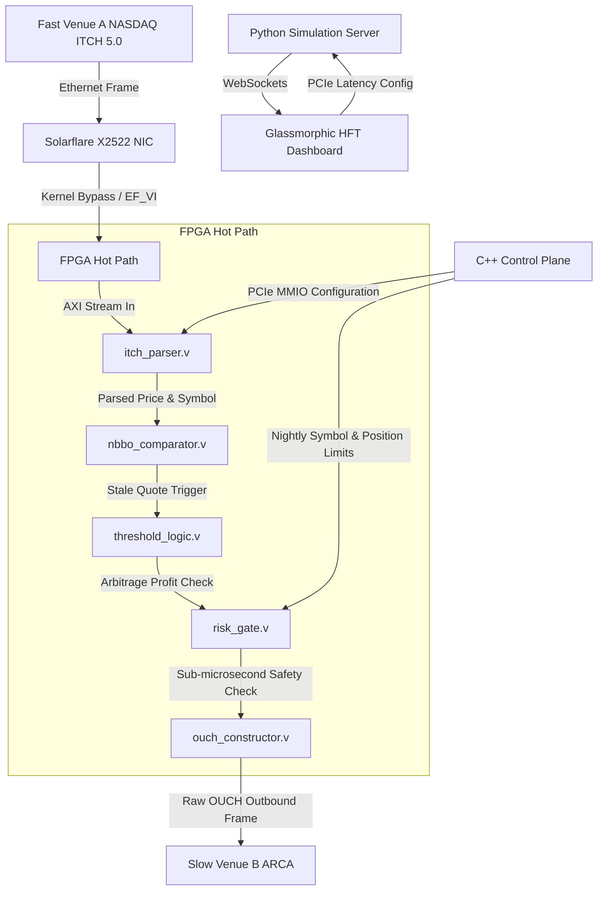

# Cross-Exchange Latency Arbitrage Engine

An ultra-low-latency, sub-microsecond cross-venue latency arbitrage trading engine. Features a hybrid **FPGA (hot path)** Verilog pipeline, a **C++ (control plane)** co-simulated with **Verilator**, backed by a **Python research suite** and a live **interactive glassmorphic visual dashboard**.

Designed to capture multi-venue pricing discrepancies (e.g., NASDAQ vs. ARCA) by executing fast-venue market updates onto slow-venue order books before stale orders can be cancelled.

---

## 📈 Theoretical Framework & Latency Arbitrage Math

Cross-venue latency arbitrage is a high-frequency race. An opportunity exists when the quote difference between venue $A$ (fast) and venue $B$ (slow) exceeds the execution costs and premium:

$$|P^A_t - P^B_t| > spread^B + cost + race\_premium$$

Where:
* $P^A_t$: Price of the asset on the fast venue at time $t$.
* $P^B_t$: Price of the asset on the slow venue at time $t$.
* $spread^B$: The bid-ask spread on slow venue $B$.
* $cost$: Transaction costs (clearing fees, exchange fees, borrow costs).
* $race\_premium$: The risk-adjusted premium accounting for competition.

### The HFT Race & Winner Probability

The probability $P_{capture}(N)$ of the $N$-th fastest participant successfully capturing the arbitrage opportunity (winning the execution race against other aggressive orders and the slow-market maker's cancellation orders) decays geometrically according to the competitor density and latency gap:

$$P_{capture}(N) \approx \frac{1}{N} e^{-\lambda_{competitor} \Delta_N}$$

Where:
* $N$: Latency rank among race participants ($1 = \text{winner}$).
* $\Delta_N$: Latency differential between rank $N$ and the absolute winner.
* $\lambda_{competitor}$: The arrival rate of competing messages (cancellations and orders).

---

## ⚡ Target Latency Budget (< 1μs)

Every nanosecond matters. The tick-to-trade hot path budget is optimized for sub-microsecond end-to-end latency:

```
[ NIC PHY In ]   --->   50ns  (Optical-to-Electrical Conversion)
[ EF_VI Poll ]   --->  200ns  (Solarflare Kernel-Bypass Ingestion)
[ ITCH Parser]   --->  100ns  (Hardware NASDAQ ITCH Message Parsing)
[ NBBO Comp  ]   --->  100ns  (Hardware Order Book Comparators)
[ Thresh Log ]   --->  100ns  (Arbitrage Threshold Decision Matrix)
[ Risk Gate  ]   --->   50ns  (Hardware-Level Pre-Trade Risk Gate)
[ OUCH Const ]   --->  100ns  (OUCH 4.2 Outbound Frame Assembler)
[ NIC PHY Out]   --->   50ns  (Electrical-to-Optical Conversion)
----------------------------------------------------------------------
Total Path       --->  700ns  (Tick-to-Trade Hot Path)
```

---

## 🛠️ System Architecture

The engine is split into three highly optimized layers:



### 1. Hardware Hot Path (FPGA in synthesizable Verilog)
* **`itch_parser.v`**: Fully synthesizable NASDAQ ITCH 5.0 binary protocol parser. Handles stock directory and add-order messages in clock cycles.
* **`nbbo_comparator.v`**: Compares incoming fast-venue prices with current local configurations for the slow venue.
* **`threshold_logic.v`**: Checks if the spread exceeds transaction thresholds ($> spread^B + cost$) using high-speed integer math.
* **`risk_gate.v`**: A sub-microsecond hardware safety check that validates position size limits and supports an external emergency hardware kill-switch.
* **`ouch_constructor.v`**: Dynamically constructs outbound NASDAQ OUCH 4.2 protocol orders at the gate-level in binary form.

### 2. Control Plane (C++17 with Verilator Co-simulation)
* **`circular_buffer.hpp`**: Lock-free, single-producer single-consumer cache-aligned ring buffer optimized for core-to-core signaling.
* **`pcie_dma.cpp`**: Models a memory-mapped I/O (MMIO) register map for real-time risk parameter, threshold, and quote updates.
* **`solarflare_mock.cpp`**: Mock representation of Solarflare's `EF_VI` kernel bypass drivers for low-latency frame polling.
* **`control_plane.cpp`**: Loads daily parameters, manages active symbols, and handles run-time parameter updating.

### 3. Simulation & Web Dashboard (Python & HTML5/CSS3)
* **`sim_server.py`**: Zero-dependency async WebSocket server simulating real-time market data ticks and latency-race statistics.
* **`backtester.py`**: Runs quantitative backtesting on dual-venue tick data.
* **`race_simulator.py`**: Models HFT race probabilities and adverse selection curves.
* **`web/index.html`**: A dashboard utilizing sleek CSS glassmorphism, glowing telemetry cards, pipeline node micro-animations, and latency controls.

---

## 📁 Repository Directory Layout

The directory structure is organized at the absolute root of the repository:

```
├── .github/workflows/    # CI/CD automated build configurations
│   └── ci.yml            # GitHub Actions compilation check
├── cpp/                  # C++17 Control Plane & Drivers
│   ├── circular_buffer.hpp
│   ├── cli_monitor.cpp
│   ├── control_plane.cpp/.hpp
│   ├── pcie_dma.cpp/.hpp
│   ├── sim_main.cpp
│   ├── software_risk_gate.hpp
│   ├── solarflare_mock.cpp/.hpp
│   └── telemetry.cpp/.hpp
├── docs/                 # Hardware Specifications & Operational Runbooks
│   ├── architecture.md
│   ├── cabling_guide.md
│   └── deployment_runbook.md
├── fpga/                 # Synthesizable FPGA Verilog Modules
│   ├── itch_parser.v
│   ├── nbbo_comparator.v
│   ├── ouch_constructor.v
│   ├── risk_gate.v
│   ├── tb_itch_parser.v
│   ├── threshold_logic.v
│   └── top_latency_arb.v
├── python/               # Quantitative Models & Simulators
│   ├── backtester.py
│   ├── data_generator.py
│   ├── pcap_to_itch.py
│   ├── race_simulator.py
│   └── sim_server.py
├── tests/                # Testing Frameworks
│   ├── test_circular_buffer.cpp
│   └── test_race_premium.py
├── web/                  # Real-Time Visual Simulator
│   ├── app.js
│   ├── index.html
│   └── terminal.css
├── CMakeLists.txt        # Native C++ and Verilator CMake Build System
├── README.md             # Project Portfolio Documentation
└── .gitignore            # Clean git rules
```

---

## 🚀 Running the Visual Simulation

You can run the simulated interactive dashboard locally:

### 1. Launch the WebSocket Market Feed
```powershell
python python/sim_server.py
```
This boots up a simulator running on `ws://localhost:8765`, outputting synthetic quotes, spread discrepancies, and race telemetry.

### 2. Launch the Glassmorphic Dashboard
Simply open **`web/index.html`** in any browser. You can:
* Use the slider to increase/decrease network latency.
* Watch real-time capture probabilities change.
* Toggle the hardware kill-switch.
* Inspect live execution logs, order tokens, and PnL.

---

## 🧪 Testing and CI/CD

### Native Verification
Run C++ unit tests locally:
```bash
python -m unittest tests/test_race_premium.py
```

### GitHub Actions CI
On every push, the project runs `.github/workflows/ci.yml` in a pristine Linux container:
1. Installs compilation dependencies (`build-essential`, `python3`, `verilator`).
2. Generates CMake configurations.
3. Compiles executable binaries (`sim_main`, `cli_monitor`) using native compilers.
4. Executes tests via `ctest`.

---

## 📡 Production Deployment & Fiber Specs

For physical deployments in high-frequency trading spaces:
* **Fiber Matching**: Always match fiber patch cables connecting the switch to the NIC to within **< 10cm** of length tolerance to guarantee equal latency across channel feeds.
* **Fiber Latency**: Signal propagation through single-mode optical fiber (core index $n \approx 1.468$) incurs a latency penalty of **~4.9ns per meter**. Standard DAC copper cables should be used inside the cabinet to eliminate transceiver conversion times.
* **Kernel Bypass**: Enable Solarflare EF_VI or Mellanox VMA to bypass the OS kernel network stack entirely, bringing user-space frame ingest down from ~15μs to under **200ns**.
